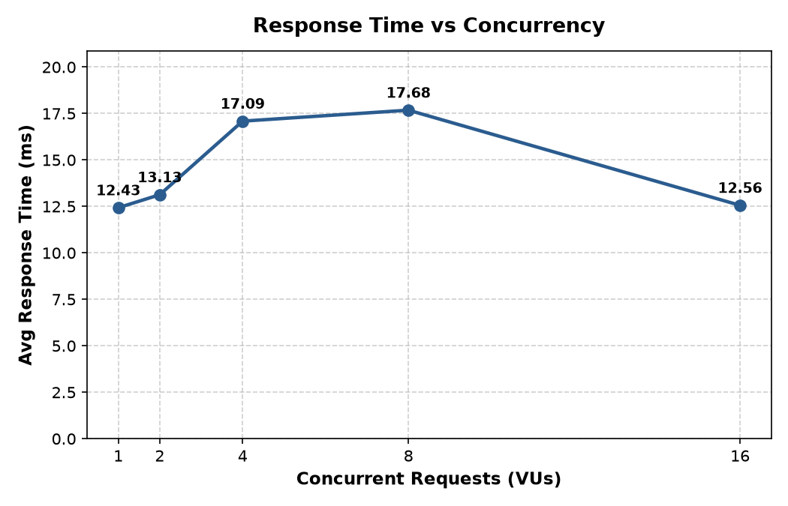
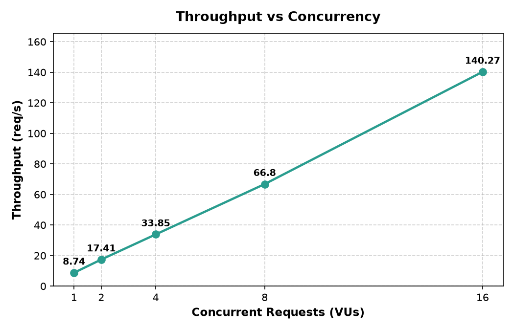
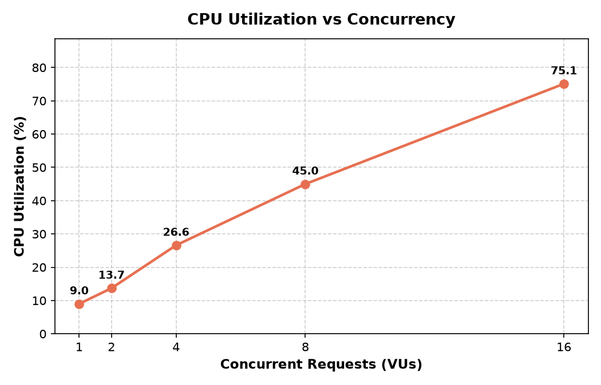
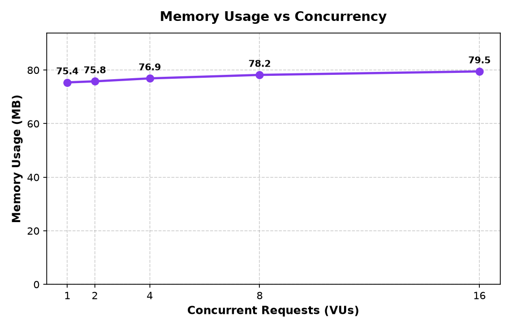

# Festify — Containerized Microservice Application

[](https://www.docker.com/)
[](https://docs.docker.com/compose/)
[](https://k6.io/)
[](https://www.python.org/)

A 3-tier containerized microservices application developed for the Cloud Computing Laboratory Evaluation. The application manages student registrations for a college fest, demonstrating multi-container orchestration, inter-service networking, k6 workload generation, real-time resource profiling, and performance curve synthesis.

---

## Documentation
- **Full Lab Report:** See [`LAB_REPORT.md`](LAB_REPORT.md) for detailed theory, checkpoint walkthroughs, evaluation tables, and professor defense points.
- **Empirical Observations:** See [`results/observations.md`](results/observations.md) for live benchmark values.
- **Implementation Plan:** See [`implementation_plan.md`](implementation_plan.md).

---

## System Architecture

```
                       [ Client / k6 Load Generator ]
                                     │
                                     │ POST http://localhost:5003/register
                                     ▼
                      ┌──────────────────────────────┐
                      │     Registration Service     │ (Port 5003)
                      │   [Orchestrator / Gateway]   │
                      └──────────────┬───────────────┘
                                     │
              ┌──────────────────────┴──────────────────────┐
              │ GET http://student-service:5001/students/S01 │ GET http://event-service:5002/events/E01
              ▼                                             ▼
┌──────────────────────────────┐              ┌──────────────────────────────┐
│       Student Service        │              │        Event Service         │
│  (Port 5001 - Fest Registry) │              │ (Port 5002 - Seat Allocation)│
└──────────────────────────────┘              └──────────────────────────────┘
              ▲                                             ▲
              └──────────────────────┬──────────────────────┘
                                     │
                    [ Docker Network: fest-network ]
```

---

## Quickstart

### 1. Prerequisites
- Docker & Docker Compose
- `k6` (`brew install k6`)
- Python 3 with `matplotlib` and `pandas` (`pip install matplotlib pandas`)

### 2. Build & Start Containers
```bash
# Build images and start all three containers in detached mode
docker compose up -d

# Verify all three containers are healthy
docker compose ps
```

### 3. Verify Endpoints

#### Independent Service Check
```bash
# Student Service (5001)
curl http://localhost:5001/students/S01

# Event Service (5002)
curl http://localhost:5002/events/E01
```

#### End-to-End Registration (Touches All 3 Services)
```bash
curl -X POST http://localhost:5003/register \
  -H "Content-Type: application/json" \
  -d '{"student_id":"S02","event_id":"E02"}'
```

---

## 📊 Workload Testing & Monitoring

### Automated Benchmark Suite
Run the automated runner that tests 5 concurrency tiers (1, 2, 4, 8, 16 VUs), samples `docker stats`, updates the observation table, and regenerates graphs:
```bash
python3 benchmark_runner.py
```

### Manual k6 Execution
To test a specific concurrency level (e.g., 8 concurrent users):
```bash
k6 run --env VUS=8 load_test.js
```

### Container Resource Monitoring
Watch live CPU and memory utilization across the containers:
```bash
docker stats --format "table {{.Name}}\t{{.CPUPerc}}\t{{.MemUsage}}"
```

---

##  Performance Results

Measured during live evaluation:

| Workload | Concurrency | Avg Resp Time | Throughput | Failures | Total CPU % | Memory |
|:---:|:---:|:---:|:---:|:---:|:---:|:---:|
| **W1** | 1 VU | 12.43 ms | 8.74 req/s | 0 | 9.0% | 75.4 MB |
| **W2** | 2 VUs | 13.13 ms | 17.41 req/s | 0 | 13.7% | 75.8 MB |
| **W3** | 4 VUs | 17.09 ms | 33.85 req/s | 0 | 26.6% | 76.9 MB |
| **W4** | 8 VUs | 17.68 ms | 66.80 req/s | 0 | 45.0% | 78.2 MB |
| **W5** | 16 VUs | 12.56 ms | 140.27 req/s | 0 | 75.1% | 79.5 MB |

### Generated Performance Curves
| Metric | Graph |
|---|---|
| **Response Time** |  |
| **Throughput** |  |
| **CPU Utilization** |  |
| **Memory Footprint** |  |

---

## Tear Down
To stop and remove containers and networks:
```bash
docker compose down
```
